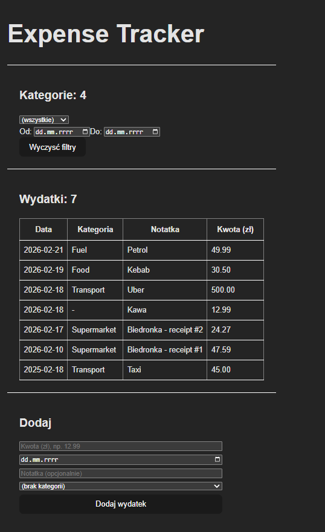

# Expense Tracker (React + Node.js + PostgreSQL)

Aplikacja webowa do zarządzania wydatkami napisana w technologii React + Node.js + PostgreSQL.

---

## Aktualne funkcjonalności
- Dodawanie wydatków (data, kategoria, notatka, kwota)
- Kategorie wydatków
- Filtrowanie po:
  - kategorii
  - zakresie dat
- Relacje w bazie danych (Expense -> Category)
- REST API (Express)
- Obsługa błędów i walidacja podstawowych danych
- Przechowywanie kwot w groszach

---

## Zrzut ekranu



---

## Stack technologiczny

**Frontend**
- React (Vite)
- Fetch API
- Podział na komponenty (Filters, ExpenseForm, ExpenseList)

**Backend**
- Node.js
- Express
- Prisma ORM
- PostgreSQL

---

## Struktura projektu
```
expense-tracker/
│
├── backend/
│   ├── src/
│   │   ├── routes/
│   │   ├── db/
│   │   └── server.js
│   └── prisma/
│
├── frontend/
│   ├── src/
│   │   ├── components/
│   │   └── App.jsx
│
└── README.md
```
---

## Uruchomienie lokalne

### Backend

1. Utwórz bazę danych PostgreSQL, np.:
   `expense_tracker`

2. Skopiuj plik:
   `backend/.env.example`
   jako:
   `backend/.env`

3. Ustaw poprawny `DATABASE_URL`

4. Zainstaluj zależności i uruchom:
```
cd backend
npm install
node src/server.js
```
Backend dostępny pod: http://localhost:3000

### Frontend
```
cd frontend
npm install
npm run dev
```
Frontend dostępny pod: http://localhost:5173

---

## Plan rozwoju

- Autoryzacja użytkowników (JWT)
- Dashboard ze statystykami miesięcznymi
- Wykresy wydatków
- Deployment
- Testy jednostkowe

---

## Cel projektu

- budowy aplikacji fullstack
- pracy z REST API
- modelowania relacji w bazie danych
- organizacji kodu (podział na komponenty i routery)